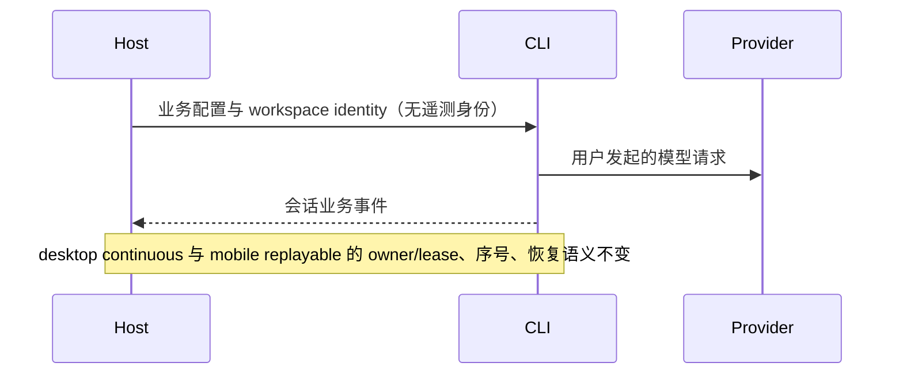

# Open Audit CLI 遥测删除边界

CLI 不初始化遥测 SDK、OTLP exporter、模型 API recorder，不产生遥测网络请求，关闭时不等待遥测 flush。删除 @zcode/telemetry 包、bootstrap 初始化 API、services telemetryCore。conversation telemetry 包装仍被 UI 使用，保留纯本地订阅公开 API。

Host 不再读取 OAuth 身份用于遥测，不向 Agent 注入 OTLP 配置或遥测身份。设备身份模块仍由原业务所有者管理；不删除磁盘用户数据。logger、用户主动反馈、Provider 请求、MCP 进程资源查询保留。

运行时核心已有的可选 tracing 端口使用既有无 IO 实现，bootstrap 不再装配外部 exporter；不新增兼容占位模块。

业务会话事实的所有者仍是 CLI runtime。conversationTelemetryFact 目前被 server CLI 的运行任务计数使用；本轮保留协议、normalizer、services 订阅/转发/清理，删除其协议前必须先迁移这一业务语义。local TTFT 仅用于计时上报，删除 CLI recorder 与发送端，保留仍被 UI 编译使用的 shared 兼容类型；services 的公开 TTFT 订阅返回 Event.None，附中文兼容说明。

验收：无 telemetry workspace 包及初始化引用；根 typecheck/lint 通过；CLI typecheck/build/lint 与改动前基线比较；`pnpm test:no-telemetry` 确认删除边界及业务事实保留，并作为 `pnpm verify:pre-push` 的第一项。不变更 README/site，不提交 Git。
