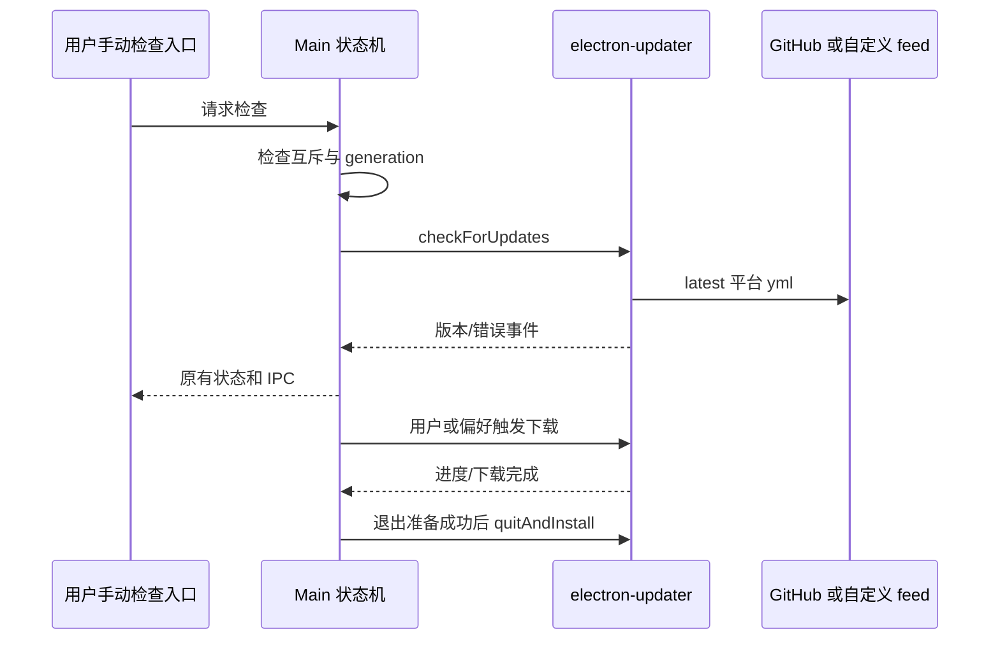

# ZCodium 桌面更新

## 规则与边界

- Main `autoUpdater.ts` 是更新状态、检查互斥、下载取消和安装调度的唯一所有者；UI 和 IPC 载荷不变。
- 使用 electron-updater 内置 generic provider，默认根地址为 `https://github.com/ZCodium-project/ZCodium/releases/latest/download/`。
- 读取 latest.yml、latest-mac.yml、latest-linux.yml（非 x64 Linux 使用 updater 原生架构后缀）；元数据中的文件路径、校验和与下载安装由 updater 处理。macOS 自动更新需要发布 ZIP 等原生 updater 所需资源，不能只有 DMG。
- 启动参数 `--zcode-update-feed-url` 优先于 `ZCODE_UPDATE_FEED_URL`，开发及打包环境均可覆盖为 generic feed 根目录。覆盖不再接受旧官方 manifest API 语义。
- 默认只发布 latest 稳定通道，preview 偏好不会切换到官方接口或请求 preview.yml；版本跳过归属 stable。保留现有 preview 产品禁用更新的边界。
- 删除自定义 ManifestUpdateProvider 与更新链路对官方 endpoint/device ID 的依赖。初始化只配置本地更新状态与 IPC；仅用户点击“检查更新”后才请求 GitHub 或自定义 feed，不在启动或后台轮询时联网。原生下载与安装流程保持不变。
- `maybeBlockStartupForForceUpdate` 保留签名及调用点，直接返回 `{ blocked: false }`；不读取配置、不调用注入的 fetch、不展示弹窗、不触发回调。
- `requestForceAutoUpdate` 保留签名及 disposer，成为无副作用 no-op。
- 元数据缺失、网络失败及校验错误沿用现有错误状态，不回退官方服务。登录、分享、反馈等连接不在本轮范围。

## GitHub 发布恢复

- `.github/workflows/release.yml` 是发布标签、Release 和 Windows x64 安装包的唯一所有者；桌面更新客户端只读取其已发布的 Windows `latest.yml`、安装包与 blockmap。
- 此桌面产品只交付 Windows x64 `.exe`，发布不构建 macOS、Linux 或 CLI 资产。发布说明只描述 Windows 的未签名安装与校验方式。
- 常规发布拒绝已存在的标签或 Release，避免意外覆盖已发布版本。维护者可显式选择 `resume_existing_release`，用于上一次发布在创建标签后、创建 Release 或上传资产前中断的恢复。
- 恢复模式只允许以下状态：已有标签且没有 Release 时补建 Release；已有标签和 Release 时保留 Release 并继续构建、以 `--clobber` 更新同名资产。不存在 Release 而标签不存在时仍走常规创建；Release 存在而标签不存在视为不一致并失败。
- 标签与 Release 的状态由 GitHub 维护，工作流不写入第二份发布状态。每次恢复均按版本号运行；资产上传是幂等的，失败不会删除已有资产或标签。

## 事件顺序

不新增持久化所有者，不改 Host/mobile stream 协议。检查 generation、取消 token 和安装互斥沿用现有状态机。

## 验收

- 执行真实更新模块的边界替身测试：默认 generic URL、生产环境覆盖优先级、初始化不检查、手动检查、更新事件及下载/安装 IPC 保持可用。
- 执行内置 GenericProvider，验证各平台 yml 请求和相对安装包 URL 解析。
- 守卫在注入会抛错的网络/阻塞回调时仍返回不阻塞；强制更新入口无网络、无状态回调。
- `pnpm typecheck`、`pnpm lint`、架构检查通过；真实签名安装包升级需发布后另行验证。
- 发布恢复需要验证：标签已存在且 Release 缺失时能补建 Release；已有 Release 时不重复创建；恢复构建后 Release 只包含 Windows x64 安装包、`latest.yml` 和 blockmap。
