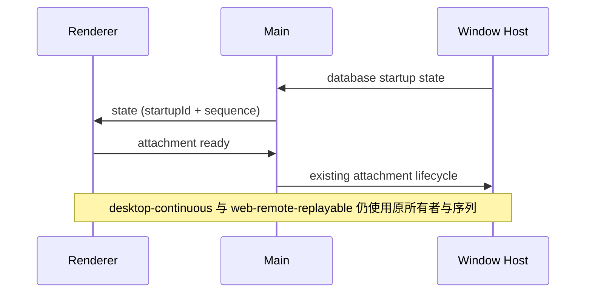

# Open Audit：桌面端无遥测

桌面端不初始化 ARMS、OTLP、使用事件上报、网络观测或定时资源遥测；环境变量与远端配置不得重新开启这些出口。删除 SDK、专属 patch、采集模块及 preload/IPC 上报桥。

本地 logger、用户主动反馈与日志导出、业务网络请求和用户主动打开的资源管理器保留。共享平台接口及桌面适配器已删除 report 方法，不保留空操作遥测桥。

唯一业务所有者不变：Host 管理数据库启动与会话，Main 转发端口与状态，Renderer 展示。删除旁路观察者，不改变 owner/lease、workspaceIdentity、attachment 代际和去重规则。

崩溃采集模块整体删除，连同其自定义 dump 归档、OOM 注解和周期清理；已有日志与磁盘文件不删除。错误仍由现有 logger 记录。

验收：指定文件与生成物不存在；无 ARMS/OTLP 导出依赖或入口；数据库 ready/failed 转发、OAuth 深链投递和远程连接不依赖遥测；根目录 typecheck 和 lint 通过。静态防回归检查覆盖出口和依赖，实际桌面端运行验证受本机环境约束时单独说明。
