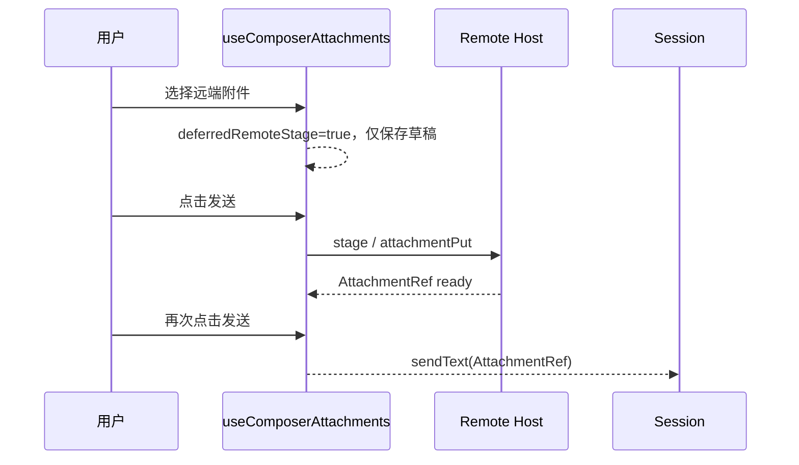

# 远端附件外发确认

## 规则与所有权

- `useComposerAttachments` 是 Composer 附件暂存状态的唯一 owner；远端附件在选取、拖放或粘贴时只留在 Composer 草稿，不得调用 transfer service 或 attachment put。
- 用户点击发送是远端暂存的明确确认。该次点击把待确认附件入队；传输完成前不提交文本，用户再次发送时复用 ready `AttachmentRef` 提交会话。
- 本地 workspace 的 `localPath` 零拷贝行为不变；它没有跨主机传输。已由 session 接管的附件也不重复暂存。
- 选择后移除附件不会产生远端数据；首次发送后失败、取消和 runtime 重建仍沿用既有 cleanup、重试和 ownership 规则。

## 事件顺序

## 验收

- 静态回归测试证明远端附件有明确的 `deferredRemoteStage` 门禁，选择阶段不调用 `enqueueUpload`。
- 首次发送才释放门禁并入队；未完成时 `prepareForSend` 返回 `null`，不能发送带缺失引用的文本。
- `pnpm typecheck`、`pnpm lint`、架构检查和附件出口测试通过。
