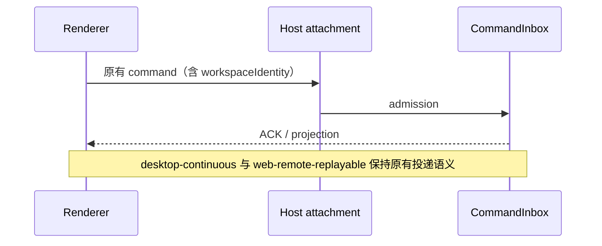

# UI、平台与 Server 移除遥测

UI 不采集或上报操作追踪、发送/打开耗时、TTFT、性能、错误、登录、引导、自动化和购买漏斗事件。删除采集模块及平台报告方法，不保留空操作适配器。业务回调直接执行，保留返回值、异常、错误边界、反馈、日志和原有交互。

状态所有者不变：CLI CommandInbox 接受输入，Host 路由，SessionDataLayer 管理订阅引用，Renderer 保留草稿和 optimistic overlay。删除旁路观察器不会改变 ACK、队列确认、owner/lease、workspaceIdentity、序列或恢复行为。

平台移除 reportTelemetryEvent、reportArmsCustomEvent、renderer action trace 桥。remote connectTrigger 保持字段和值兼容，将类型移入业务命名模块。server 不再开启 processResourceTelemetry。

设备身份文件 telemetry-state.json / telemetry-state.lock 仍由 services 单一所有者管理，兼容旧版本与同机 CLI，供业务 X-Device-Mid 使用；不新增遥测状态。ConversationTelemetryFact 仍是任务活跃状态消费的既有协议事实，暂不改跨版本 wire schema。主动反馈所需的脱敏不删除。

验收：`pnpm test:no-telemetry` 的静态出口防回归检查通过，业务包装回调保留；该检查已纳入 `pnpm verify:pre-push`。根目录 pnpm typecheck 成功、pnpm lint 为 0 error；架构无新增违反。交互验收场景为发送/队列确认、自动化创建、设置保存、OAuth/购买页面打开、错误边界重试和主动反馈；本轮不改变这些交互，未实际运行 E2E 必须在报告中说明。
